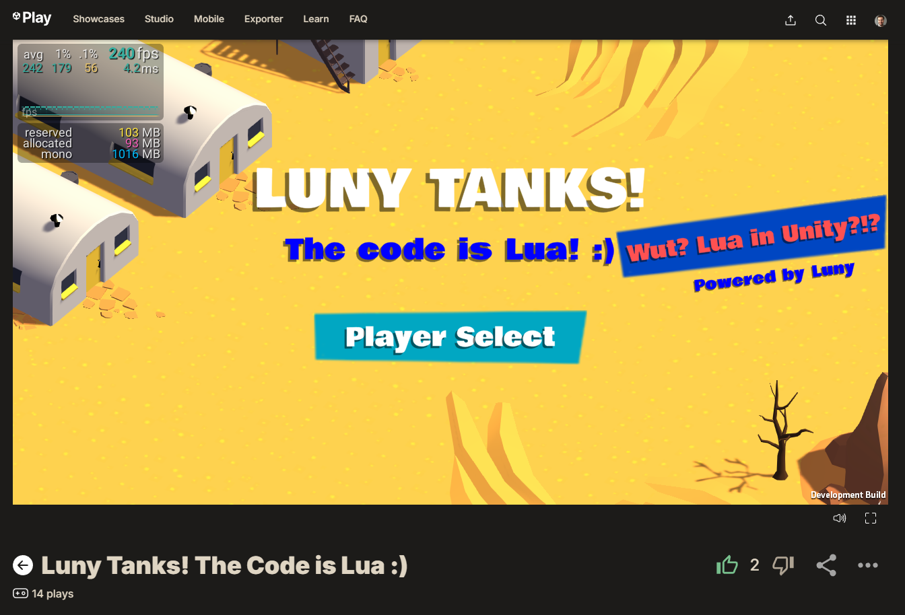

# Luny Tanks! for Unity 6 (Remastered)

Unity's Tanks! project with all C# scripts ported to [Lua scripts](https://github.com/CodeSmile-0000011110110111/Luny-Tanks-for-Unity-6/tree/main/Assets/_LunyTanks/Scripts). Powered by [Luny](https://lunyscript.com), the Lua solution for Unity. 

## [Join my Patreon](https://www.patreon.com/c/CodeSmile), get notified when Luny is released!

**CAVEAT:** This project is **NOT playable** because Luny itself is not included. Luny is (will be) [available separately](https://lunyscript.com). Luny can be imported into this project to make it playable/buildable again.

# Ported Lua Scripts

These are the scripts you should be reviewing:
- [LunyCameraControl.lua](Assets/_LunyTanks/Scripts/Camera/LunyCameraControl.lua)
- [LunyGameManager.lua](Assets/_LunyTanks/Scripts/Managers/LunyGameManager.lua)
- [LunyTankManager.lua](Assets/_LunyTanks/Scripts/Managers/LunyTankManager.lua) (not a MonoBehaviour)
- [LunyTankAI.lua](Assets/_LunyTanks/Scripts/Tank/LunyTankAI.lua)
- [LunyTankMovement.lua](Assets/_LunyTanks/Scripts/Tank/LunyTankMovement.lua)
- [LunyTankShooting.lua](Assets/_LunyTanks/Scripts/Tank/LunyTankShooting.lua)
- [LunyTankHealth.lua](Assets/_LunyTanks/Scripts/Tank/LunyTankHealth.lua)
- [LunyTankInputUser.lua](Assets/_LunyTanks/Scripts/Tank/LunyTankInputUser.lua)
- [LunyShellExplosion.lua](Assets/_LunyTanks/Scripts/Shell/LunyShellExplosion.lua)

The syntax is subject to change prior to release. Specifically the 'all lowercase' types will likely be changed to match Unity's API.

## [Join my Patreon](https://www.patreon.com/c/CodeSmile) to not miss out!

# Unity Tanks! on the web

- [Tanks! 'ported to Lua' announcement](https://lunyscript.com/2025/05/09/luny-tanks-the-code-is-lua/)
- [Tanks! 'Learn Along' Thread](https://discussions.unity.com/t/official-unity-learn-event-learn-along-featuring-tanks-remastered-for-unity-6-on-unity-learn/1633869)
- [Tanks! on Unity Learn](https://learn.unity.com/course/tanks-make-a-battle-game-for-web-and-mobile)
- [Tanks! on the Asset Store (free)](https://assetstore.unity.com/packages/essentials/tutorial-projects/tanks-complete-project-46209)

## Licenses

- **Unity Tanks!** is under [Unity Companion License](https://unity.com/legal/licenses/unity-companion-license)
- Lua scripts are under [MIT License](https://opensource.org/license/mit)
