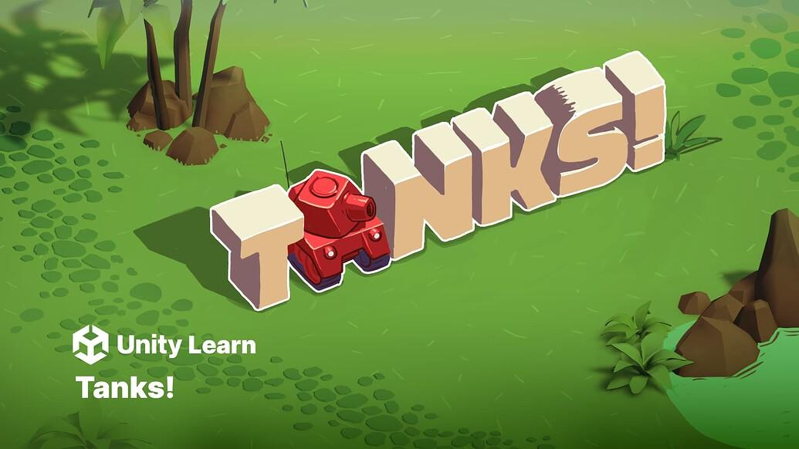

# Luny Tanks! for Unity 6 (Remastered)

Unity's Tanks! project with all C# scripts ported to [Lua scripts](https://github.com/CodeSmile-0000011110110111/Luny-Tanks-for-Unity-6/tree/main/Assets/_Tanks/Scripts/Lua). Powered by [Luny](https://lunyscript.com), the Lua solution for Unity. 

**CAVEAT:** This project is NOT playable/buildable because Luny itself is not included. Luny is (will be) [available separately](https://lunyscript.com). Luny can be imported into this project to make it playable/buildable again.

# Unity Tanks! on the web

- [Tanks! 'Learn Along' Thread](https://discussions.unity.com/t/official-unity-learn-event-learn-along-featuring-tanks-remastered-for-unity-6-on-unity-learn/1633869)
- [Tanks! on Unity Learn](https://learn.unity.com/course/tanks-make-a-battle-game-for-web-and-mobile)
- [Tanks! on the Asset Store (free)](https://assetstore.unity.com/packages/essentials/tutorial-projects/tanks-complete-project-46209)

## Licenses

- **Unity Tanks!** is under [Unity Companion License](https://unity.com/legal/licenses/unity-companion-license)
- Lua scripts are under [MIT License](https://opensource.org/license/mit)
- [LuaCSharp](https://github.com/CodeSmile-0000011110110111/Lua-CSmile) is under [MIT License](https://opensource.org/license/mit)
